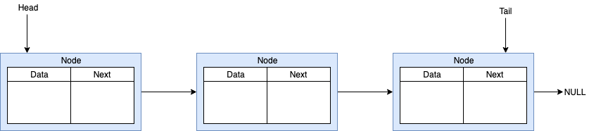

[Repositorio del código](https://github.com/mavamo135/linked_list)

[Documentación del código](https://mavamo135.github.io/linked_list/html/index.html)

Las listas enlazadas tienen la finalidad de enlazar estructuras mediante
el uso de apuntadores, en la siguiente figura se muestra un ejemplo de una 
lista enlazada.

<p align="center">
	
</p>

Como se ve en la figura la lista enlazada tiene un apuntador al primer nodo
de la lista enlazada llamado `head` y tiene un apuntador al último nodo de la
lista enlazada llamado `tail`. Cada nodo de la lista enlazada tiene un apuntador
al siguiente nodo y el último nodo apunta a `NULL` para indicar el final de la
lista.

Una parte fundamental para definir las listas enlazadas es la estructura que 
define a los nodos y se define de la siguiente manera.

```c{numberLines: true}
typedef struct node_t node_t;

struct node_t
{
    void* data;     /**< Pointer to the data of the node */
    node_t* next;   /**< Pointer to the next node */
};
```

La variable `data` es un apuntador a una variable tipo `void` lo que significa
que puede apuntar a cualquier tipo de variable, se define de esta manera para 
que los nodos puedan contener diferentes tipos de variables. La variable `next` 
es un apuntador a una variable de tipo `node_t` para que de esta manera se 
puedan enlazar los nodos.

A continuación se define la estructura de la lista enlazada.

```c{numberLines: true}
typedef struct list_t list_t;

struct list_t
{
    uint8_t numElements;    /**< Number of elements in the linked list */
    size_t dataSize;        /**< Size of data of the nodes */
    node_t* head;           /**< Pointer to the head the linked list */
    node_t* tail;           /**< Pointer to the tail linked list */
    pthread_mutex_t lock;   /**< Mutex used to lock the linked list */
};
```

La variable `numElements` es utilizada para llevar registro del número de nodos 
en la lista enlazada. La variable `dataSize` es utilizada para contener el 
tamaño de las variables que son almacenadas en cada nodo. Las variables `head` 
y `tail` son los apuntadores al inicio y fin de la lista enlazada, 
respectivamente. Finalmente, la variable `lock` es utilizada para evitar 
utilizar la lista enlazada cuando está siendo utilizada por otro hilo, 
para más información visita este 
[link](https://www.thegeekstuff.com/2012/05/c-mutex-examples/?refcom%3B).

La función de inicialización es sencilla y configura la estructura para que
la variable `numElements` muestre que no hay nodos en la lista y los apuntadores
`head` y `tail` tengan un valor de `NULL`. La función además recibe, con la
variable `dataSize`, el tamaño en bytes de la variables que van a contener los 
nodos de la lista enlazada.

```c{numberLines: true}
void
list_init(list_t* list, size_t dataSize)
{
    // Initialize the structure of the linked list
    list->numElements = 0;
    list->dataSize = dataSize;
    list->head = NULL;
    list->tail = NULL;

    // Initialize R/W mutex
    // It is used to avoid working with a busy linked list
    pthread_mutex_init(&(list->lock), NULL);
}
```

Para agregar nodos a la lista, primero se requiere alocar la memoria del 
nodo y asignar el dato que va a almacenar el nodo. La función `create_node` 
recibe mediante la variable `dataSize` el tamaño en bytes del dato que va a 
almacenar y con la variable `data` un apuntador a la variable de la cual se va
a copiar el dato.

```c{numberLines: true}
static node_t*
create_node(size_t dataSize, const void* data)
{
    node_t* newNode = NULL;

    newNode = (node_t *) calloc(1, sizeof(struct node_t));
    newNode->data = calloc(1, dataSize);
    newNode->next = NULL;
    memcpy(newNode->data, data, dataSize);

    return newNode;
}
```

La función `list_push` es utilizada para agregar un nodo al final de la lista
enlazada. La función hace uso de que se conoce la dirección del último nodo de
la lista enlazada mediante la variable `tail` y asigna esta misma variable al 
nodo que se agrega. Si la lista se encuentra vacía, la función asigna al nodo
que se agrega como el inicio y fin de la lista con las variables `head` y 
`tail`, respectivamente.

```c{numberLines: true}
static void
_list_push(list_t* list, const void* data)
{
    node_t* newNode = NULL;
    newNode = create_node(list->dataSize, data);

    if (list->numElements == 0)
      { 
          list->head = newNode;
          list->tail = list->head;
      }
    else
      {
          list->tail->next = newNode;
          list->tail = newNode; 
      }
    
    list->numElements++;
}

void 
list_push(list_t* list, const void* data)
{
    pthread_mutex_lock(&(list->lock));
        _list_push(list, data);
    pthread_mutex_unlock(&(list->lock));
}
```

La función `list_pop` es utilizada para obtener el dato contenido en el último
nodo de la lista enlazada. La función regresa `1` si hubo un error y `0`si no
lo hubo. Si hay un solo nodo en la lista, regresa el dato contenido en ese nodo
y escribe un valor `NULL` a las variables `head` y `tail` para indicar que no 
hay elementos en la lista, además, el valor de la variable `numElements`
se disminuye por lo que llegaría a 0. Si hay dos o más elementos en la lista,
recorre la lista hasta encontrar el penúltimo nodo para obtener el dato
contenido en el último nodo de la lista y hacer que el penúltimo nodo ahora sea
el último nodo escribiendo en su variable `next` el valor `NULL` y haciendo que
la variable `tail` ahora sea este último nodo.

```c{numberLines: true}
static uint8_t
_list_pop(list_t* list, void* data)
{
    node_t* iterator = list->head;

    // If the linked list is empty, return error
    if (list->numElements == 0)
      {
          return 1;
      }
    // If there is only one item in the list, remove it
    else if (list->numElements == 1)
      {
          memcpy(data, list->head->data, list->dataSize);
          free_node(list->head);
          list->head = NULL;
          list->tail = NULL;
          list->numElements--;
          
          return 0;
      }

    // Get the penultimate node
    // The penultimate node is required to make it's next variable NULL
    while (iterator->next->next != NULL)
      {
          iterator = iterator->next;
      }

    // Get the last node and delete it
    memcpy(data, iterator->next->data, list->dataSize);
    free_node(iterator->next);
    iterator->next = NULL;
    list->numElements--;
    list->tail = iterator;

    return 0;
}

uint8_t 
list_pop(list_t* list, void* data)
{
    uint8_t retval;

    pthread_mutex_lock(&(list->lock));
        retval = _list_pop(list, data);
    pthread_mutex_unlock(&(list->lock));

    return retval;
}
```

Con estas funciones es suficiente para hacer que la lista enlazada tenga el 
comportamiento de una memoria LIFO (Last In First Out), sin embargo, en el 
[repositorio del código](https://github.com/mavamo135/linked_list) puedes 
encontrar funciones para agregar y obtener nodos al inicio de la lista, para 
imprimir o aplicar una operación a todos los nodos de la lista y también puedes
encontrar el código de pruebas. Para ver la documentación de las funciones 
visita el siguiente [link](https://mavamo135.github.io/linked_list/html/index.html).
